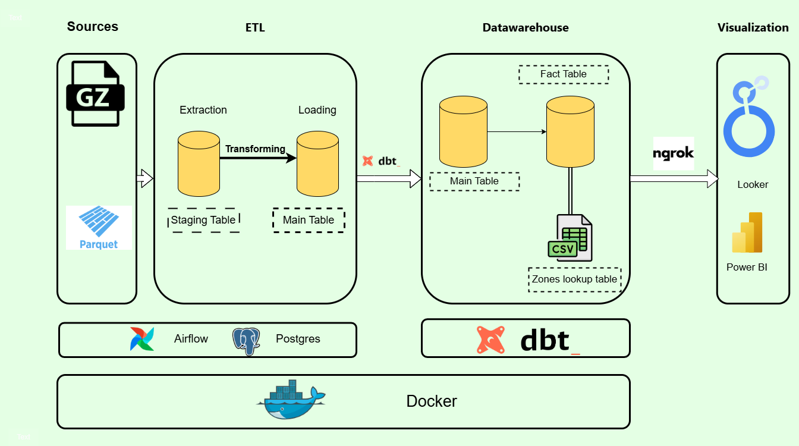

The main reason for this project is to provide an automated data pipeline that addresses real-world data engineering challenges. By leveraging publicly available data, we can create actionable insights, focusing on key performance indicators like total trips, revenue, and customer behavior.

## Pipeline Architecture


The architecture includes:
- **Data Extraction**: Using Airflow to automate the downloading and ingestion of data from the NYC Taxi dataset.
- **Data Transformation**: Applying DBT to cleanse and transform the data into a usable format.
- **Data Loading**: Storing the processed data in a PostgreSQL database encapsulated within a Docker container.

## DBT Model


The DBT model illustrates how staging and transformation tables are structured:
- **Staging Tables**: `stg_green_tripdata`, `stg_yellow_tripdata`
- **Dimension Tables**: `dim_zones`
- **Fact Table**: `fact_trips`
- The final model `dm_monthly_zone_revenue` presents aggregated insights.

## Dashboard Design
A Looker dashboard is utilized to visualize data insights, showcasing:
- **KPI Section**:
  - Total Trips
  - Total Revenue
  - Total Tips
  - Avg Fare
  - Avg Trip Distance
- **Trend Analysis**: Monthly trends in trips and revenue.
- **Geographic Insights**: Heatmaps and bar charts for zone-based exploration.
- **Customer Behavior**: Analysis of payment types and customer preferences.

## Installation Instructions
1. **Clone the Repository**: 
   ```bash
   git clone <repository-url>
   cd NYC-Taxi-Data-Engineering
   
2. **Run Docker Containers:**:
   Use the `docker-compose up` command to instantiate the environment.

3. **Access Airflow & Execute Pipeline:**
   - Navigate to localhost:port_used_in_docker_Compose to interact with the Airflow UI.
   - Trigger the dag and you can easily change the years or months that you want to analyze.

4. **DBT**
   - DBT is (Data building tool) and really helpful for making data warehouse , test , CI/CD , documentation , and this will really be helpful.
   - You can access my notes and study of dbt in notes section.
  
## How the ETL Process Works
  1. Extract: Data is fetched from the NYC Taxi dataset, handled by Airflow's DAGs.
  2. Transform: Using DBT, raw data is converted into analytical tables.
  3. Load: Transformed data is loaded into PostgreSQL for persistent storage.

## Key Considerations and Challenges
  1. Emphasis on data integrity and reliability.
  2. Modular design allows easy modifications and scalability.
  3. Compatibility with Docker ensures consistent environment setup.
  4. No cost I want all things that be free to be used.
  5. High volume of fact table because data is huge number around 126 million row.

## Dashboard and How I Linked it with Postgres Database inside Container

To visualize the NYC Taxi data, a connection was established between the PostgreSQL database running inside a Docker container and Looker for dashboard creation. Here's how it was achieved:

### Making the Database Accessible via Ngrok

1. **Expose the Postgres Port**:
   - Use Ngrok to create a secure tunnel to the PostgreSQL database.
   - Start Ngrok on the database port (e.g., `5432`) to make it publicly accessible:
     ```bash
     ngrok tcp 5432
     ```
   - Ngrok will provide a forwarding URL, enabling external access to your local database.

2. **Update Looker's Database Connection**:
   - Configure Looker to use the Ngrok URL to connect to the PostgreSQL database securely.

### Materialized Views for Performance Optimization

Since the fact table is large, materialized views were used to enhance performance:

1. **Create Materialized Views**:
   - Construct materialized views in PostgreSQL to aggregate necessary data, improving query performance:
     ```sql
     CREATE MATERIALIZED VIEW mv_fact_summary AS
     SELECT ...
     FROM fact_trips
     WHERE ...
     GROUP BY ...;
     ```

2. **Leverage Materialized Views in Looker**:
   - Point Looker queries to use these materialized views instead of the raw fact table for faster data retrieval.

### Building the Dashboard

1. **Define Metrics and Dimensions**:
   - Use Looker’s tools to define metrics (e.g., total trips, revenue) using materialized view data.

2. **Design Visualizations**:
   - Create charts, graphs, and tables to represent each KPI and analysis area effectively.

3. **Deploy and Access**:
   - Deploy the dashboard within Looker for users to interact with real-time data through a web browser.

### Cost-effective Solution

Utilizing Ngrok and materialized views offers a free and cost-effective way to handle large datasets and provide insights efficiently, ensuring that budget constraints do not hinder data visualization.

## Dashboard


### [Dashboard Link](https://lookerstudio.google.com/reporting/ce5a09b7-291b-4fdd-bcbb-57205ba2ee8b)

## Contact Information
###For any Queries or any requsetes Do not hesitate to message me 
##### [Twitter](https://x.com/hema_aymen55)
##### [LinkedIn](https://www.linkedin.com/in/ibrahimayman10/)
##### Email : ebrahimaymenzaki55@gmail.com
